

  

<h1 align="center">Pulse Music</h1>

 An offline music player android app, with modern UI and powerful features

  
  
  

## Screenshots
| 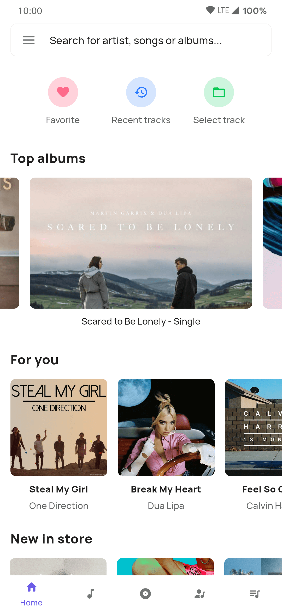 | 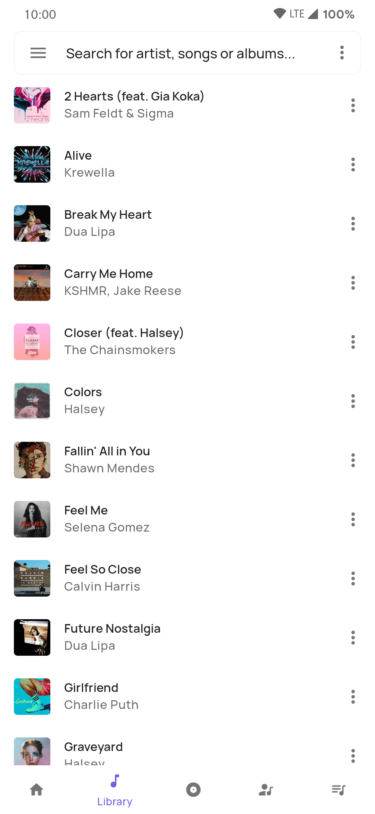 | 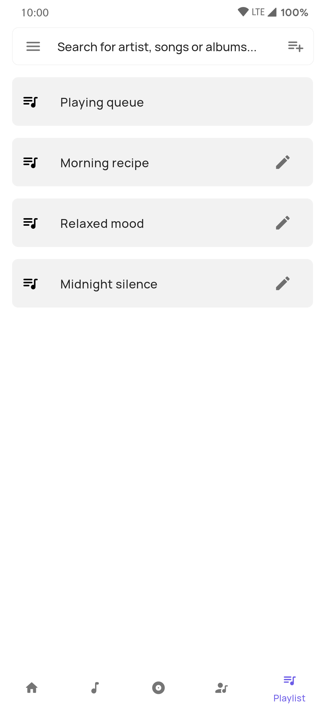 | 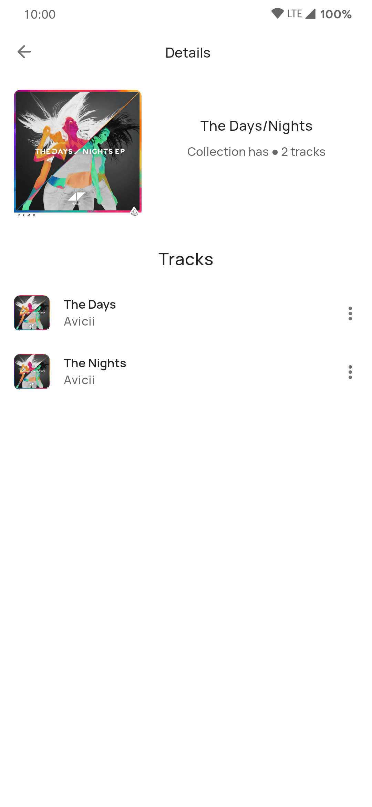 |
|:---:|:---:|:---:|:---:|
| Home | Library | Playlist |Details page |

### Now playing screen
| 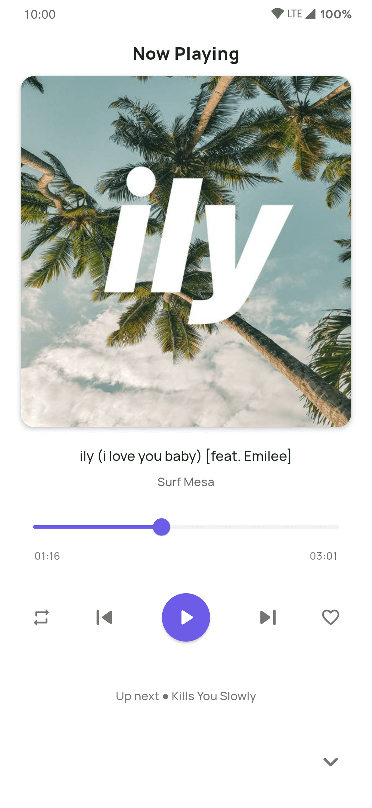 | 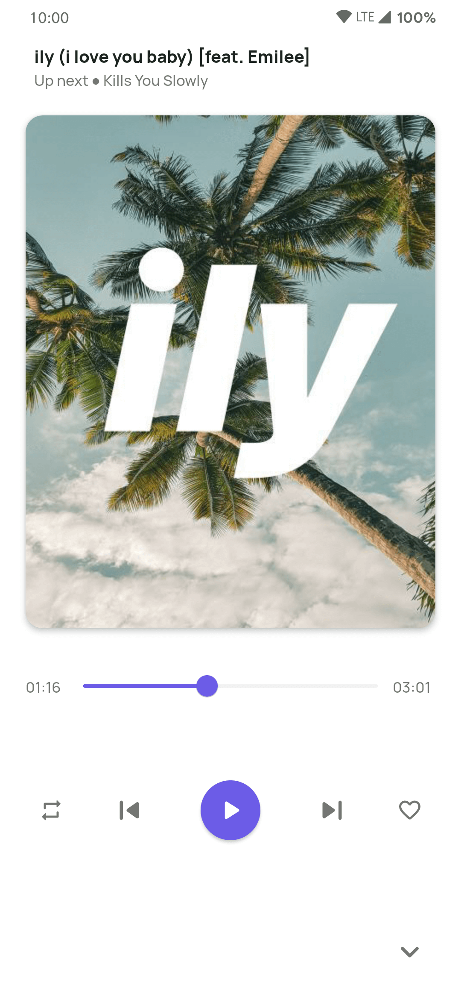 | 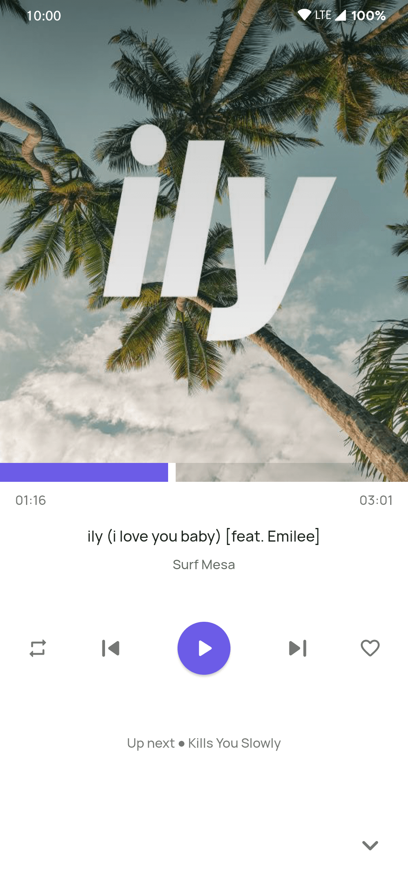 | 
|:---:|:---:|:---:|
| Modern | Stylish | Edge to edge |

### Themes
| 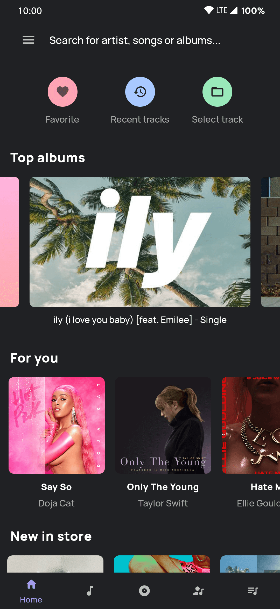 | 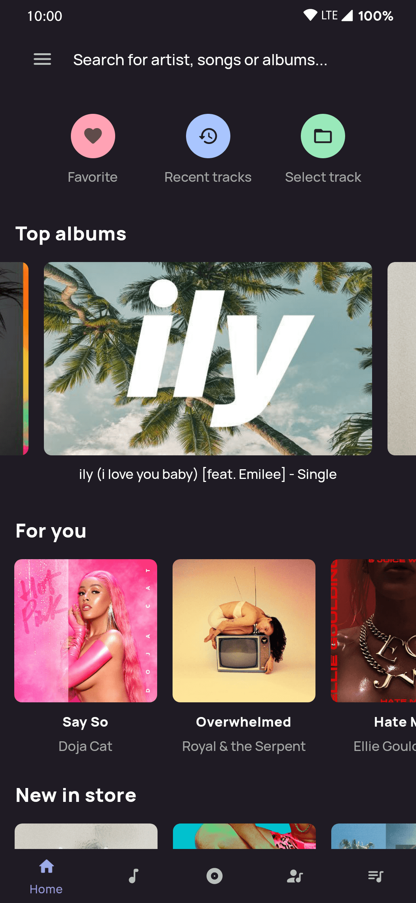 | 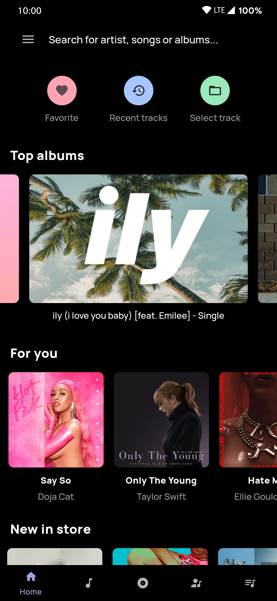 |
|:---:|:---:|:---:|
| Just gray | Signature dark | Lights out |

### Landscape ready
| 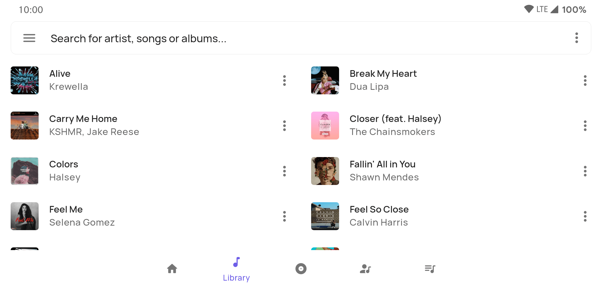 | 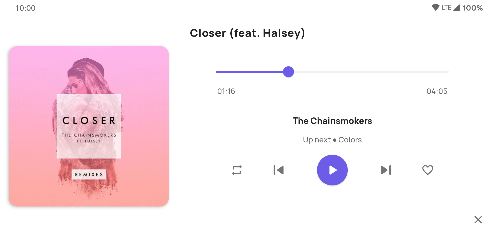 |
|:----:|:----:|
| Can change column count | Now playing screen |

### Home
Rediscover your offline collection with new suggestions based on your music preference
and mood.

### Library
Get your entire collection in one place

### Albums
Discover all the albums you have collected so far.

### Artist
Get to know all the tracks from your favorite artist

### Playlist
A powerful and customizable playlist manager where you can create your own playlist,
add tracks, change order and even add and remove tracks from your active playing queue.
But wait there's even more check it out yourself.

## Features
### Theme your music
With 3 different dark themes to and several accents to choose from, customize your music player your way.
  
**Manual dark theme toggle** : Enable dark theme whenever you want
  
**Auto theme** : Pulse Music decides which theme to apply based on time of day
  
**Accent support** : Choose from several curated accent colors
  
**Desaturated colors** : Make accent colors desaturated to better suit the dark theme (works only in dark theme)
## Other features
- Choose tracks from file explorer and play
- Change column count in landscape mode
- Add, remove re-oder current playling queue
- Smart search
- App shortcut support to play tracks without even opening the app
- All your favorite tracks in one place
- Option to change now playing screen album cover corner radius
## Releases

### Latest release: [Here](https://github.com/HardcodeCoder/PulseMusic/releases/latest/)

IMPORTANT : *Please mention the steps to reproduce the bug while reporting. Providing logs will be really helpful*

